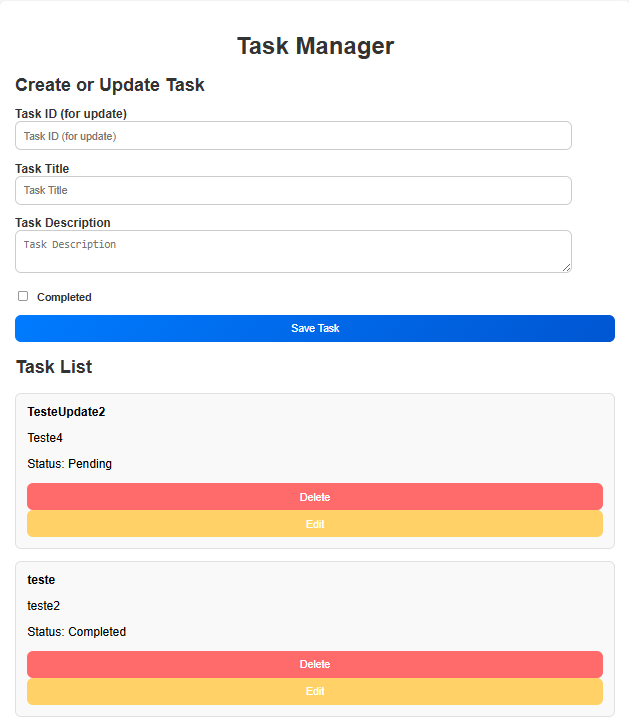

# Gerenciador de Tarefas com ZIO

## Grupo 3: Projeto com o Framework ZIO

Este projeto foi desenvolvido pelo Grupo 3 para explorar as funcionalidades do framework **ZIO**, utilizando-o para criar uma API capaz de gerenciar uma lista de tarefas.

### Funcionalidades da API
- Adicionar tarefas.
- Atualizar tarefas.
- Listar todas as tarefas.
- Excluir tarefas.

---

## Objetivo do Projeto

Este trabalho tem como objetivo aprofundar o conhecimento prático e teórico sobre os principais frameworks da linguagem **Scala**, promovendo a compreensão de como cada ferramenta pode auxiliar no desenvolvimento de aplicações funcionais.

Cada grupo recebeu a missão de estudar um framework específico, implementando um projeto demonstrativo que evidencie suas capacidades e preparando uma apresentação detalhada sobre as principais características e benefícios do framework estudado.

O Grupo 3 recebeu o **ZIO**, destacando sua robustez para a construção de aplicações funcionais reativas.  

---

Aqui está a seção sobre **Dependências** e **Como Rodar o Projeto** no README.md:


## Dependências  

O projeto utiliza as seguintes dependências no arquivo `build.sbt`:  

- **ZIO Core**: Biblioteca principal para programação funcional e reativa.  
  - `"dev.zio" %% "zio" % "2.1.1"`  
- **ZIO JSON**: Para serialização e desserialização de objetos JSON.  
  - `"dev.zio" %% "zio-json" % "0.6.2"`  
- **ZIO HTTP**: Framework para construir servidores HTTP.  
  - `"dev.zio" %% "zio-http" % "3.0.0-RC8"`  
- **Quill com ZIO**: Integração com Quill para manipulação de banco de dados usando ZIO.  
  - `"io.getquill" %% "quill-zio" % "4.7.0"`  
  - `"io.getquill" %% "quill-jdbc-zio" % "4.7.0"`  
- **H2 Database**: Banco de dados relacional para testes e desenvolvimento.  
  - `"com.h2database" % "h2" % "2.2.224"`  

### Requisitos para Executar o Projeto  
- **Scala**: Versão 3.3.4 ou superior.  
- **SBT (Scala Build Tool)**: Ferramenta de build para Scala e Java.  
- **Java**: JDK 17 ou superior.  

---

## Como Rodar o Projeto  

1. **Clone o repositório**:  
   ```bash
   git clone https://github.com/franckallyson/lista-de-tarefas-zio.git
   cd lista-de-tarefas-zio
   ```

2. **Compile as dependências**:  
   No terminal, execute o comando:
   ```bash
   sbt update
   sbt compile
   ```

3. **Inicie a aplicação**:  
   Para rodar a API localmente, use o comando:
   ```bash
   sbt run
   ```

4. **Acesse a API**:  
   Por padrão, a API estará disponível em:
   ```
   http://localhost:8080
   ```

Pronto! A aplicação estará rodando, pronta para gerenciar sua lista de tarefas.

---

## Estrutura do Projeto

### Modelo de Dados: [Task.scala](src/main/scala/tasks/Task.scala)

A API utiliza uma estrutura clara para representar as tarefas gerenciadas. Abaixo estão os detalhes do modelo utilizado:

#### Classe `Task`

A classe `Task` define a estrutura básica de uma tarefa antes de ser armazenada no sistema.

- **`title: String`**  
  O título ou nome da tarefa.
- **`description: String`**  
  Uma descrição que detalha a tarefa.
- **`isCompleted: Boolean`**  
  Um indicador que informa se a tarefa foi concluída ou não.

#### Classe `TaskReturn`

A classe `TaskReturn` representa uma tarefa após ser criada ou consultada, incluindo informações adicionais como o identificador único.

- **`id: UUID`**  
  Um identificador único para a tarefa.
- **`title: String`**  
  O título ou nome da tarefa.
- **`description: String`**  
  A descrição da tarefa.
- **`isCompleted: Boolean`**  
  O status indicando se a tarefa foi concluída.

Ambas as classes são serializáveis, utilizando as seguintes ferramentas:

- **`zio.json`**: Para serialização e desserialização de JSON.
- **`zio.schema`**: Para derivar schemas automaticamente.

### Observações

- Comentários no código indicam que as propriedades `createdAt` e `updatedAt` podem ser adicionadas futuramente para rastrear quando a tarefa foi criada ou atualizada pela última vez.
- A integração com `zio.schema` permite a validação e manipulação avançada de dados no formato especificado.

Essa estrutura permite gerenciar tarefas com simplicidade e eficiência, garantindo que as informações básicas e identificadores estejam sempre disponíveis.  

---

## Repositório de Tarefas: [TaskRepo.scala](src/main/scala/tasks/TaskRepo.scala)

A interface e o objeto `TaskRepo` são responsáveis por encapsular as operações que manipulam as tarefas no sistema. Eles seguem o estilo funcional e reativo proporcionado pelo framework **ZIO**, garantindo que as operações sejam seguras e eficientes.

### Interface `TaskRepo`

A interface `TaskRepo` define os métodos principais para gerenciar as tarefas:

- **`register(task: Task): zio.Task[String]`**  
  Registra uma nova tarefa e retorna um identificador único.

- **`update(id: String, updatedTask: Task): zio.Task[Boolean]`**  
  Atualiza uma tarefa existente com base no identificador fornecido. Retorna `true` se a atualização foi bem-sucedida.

- **`lookup(id: String): zio.Task[Option[TaskReturn]]`**  
  Busca uma tarefa pelo identificador. Retorna a tarefa encontrada ou `None` se não existir.

- **`tasks: zio.Task[List[TaskReturn]]`**  
  Retorna uma lista de todas as tarefas registradas.

- **`delete(id: String): zio.Task[Boolean]`**  
  Remove uma tarefa com base no identificador. Retorna `true` se a exclusão foi bem-sucedida.

### Objeto Companion `TaskRepo`

O objeto companion `TaskRepo` fornece implementações utilitárias para as operações definidas na interface, usando a funcionalidade de injeção de dependência do ZIO com `ZIO.serviceWithZIO`.

#### Funções disponíveis

- **`register(task: Task): ZIO[TaskRepo, Throwable, String]`**  
  Chama o método `register` de um serviço `TaskRepo` disponível no ambiente ZIO.

- **`update(id: String, updatedTask: Task): ZIO[TaskRepo, Throwable, Boolean]`**  
  Chama o método `update` para atualizar uma tarefa no repositório.

- **`lookup(id: String): ZIO[TaskRepo, Throwable, Option[TaskReturn]]`**  
  Facilita a busca de uma tarefa no repositório.

- **`tasks: ZIO[TaskRepo, Throwable, List[TaskReturn]]`**  
  Obtém todas as tarefas registradas no repositório.

- **`delete(id: String): ZIO[TaskRepo, Throwable, Boolean]`**  
  Remove uma tarefa usando o serviço `TaskRepo`.

### Benefícios

- **Segurança e Resiliência**: Usando tipos como `zio.Task`, as operações são seguras e tratam erros de maneira funcional.
- **Modularidade**: A interface permite substituir ou estender o repositório facilmente.
- **Integração com ZIO**: Aproveita a injeção de dependência do ZIO, simplificando o código e promovendo boas práticas.

---

## Rotas da API: [TaskRoutes.scala](src/main/scala/tasks/TaskRoutes.scala)

O arquivo `TaskRoutes.scala` define as rotas da API para gerenciar a lista de tarefas. Ele utiliza o framework **ZIO HTTP** para lidar com requisições HTTP e interagir com o repositório de tarefas (`TaskRepo`).

### Descrição das Rotas

1. **`POST /tasks`**
    - **Descrição**: Registra uma nova tarefa.
    - **Entrada**: JSON contendo os dados da tarefa no formato `{ "title": "...", "description": "...", "isCompleted": false }`.
    - **Saída**:
        - Código 200: Identificador da tarefa criada.
        - Código 400: Erro de validação do corpo da requisição.
        - Código 500: Erro interno ao registrar a tarefa.

2. **`GET /tasks/:id`**
    - **Descrição**: Recupera uma tarefa pelo identificador.
    - **Entrada**: Identificador da tarefa como parâmetro de URL.
    - **Saída**:
        - Código 200: JSON com os dados da tarefa.
        - Código 404: Tarefa não encontrada.
        - Código 500: Erro interno ao buscar a tarefa.

3. **`GET /tasks`**
    - **Descrição**: Lista todas as tarefas registradas.
    - **Entrada**: Nenhum parâmetro.
    - **Saída**:
        - Código 200: JSON com a lista de tarefas.
        - Código 500: Erro interno ao listar as tarefas.

4. **`PUT /tasks/:id`**
    - **Descrição**: Atualiza uma tarefa pelo identificador.
    - **Entrada**:
        - Identificador da tarefa como parâmetro de URL.
        - JSON com os dados atualizados no formato `{ "title": "...", "description": "...", "isCompleted": false }`.
    - **Saída**:
        - Código 200: Mensagem de sucesso na atualização.
        - Código 404: Tarefa não encontrada.
        - Código 400: Erro de validação do corpo da requisição.
        - Código 500: Erro interno ao atualizar a tarefa.

5. **`DELETE /tasks/:id`**
    - **Descrição**: Exclui uma tarefa pelo identificador.
    - **Entrada**: Identificador da tarefa como parâmetro de URL.
    - **Saída**:
        - Código 200: Mensagem de sucesso na exclusão.
        - Código 404: Tarefa não encontrada.
        - Código 500: Erro interno ao excluir a tarefa.

### Benefícios

- **Clareza**: Cada rota possui uma responsabilidade bem definida, facilitando a manutenção e expansão.
- **Tratamento de Erros**: Mensagens de erro claras e diferenciadas para problemas de validação, recurso não encontrado ou erros internos.
- **Integração com ZIO**: Utiliza as funções do repositório (`TaskRepo`) para realizar as operações de forma reativa e funcional.

---

## Repositório Persistente: [PersistentTaskRepo](src/main/scala/tasks/PersistentTaskRepo.scala)

O arquivo `PersistentTaskRepo.scala` implementa o repositório de tarefas utilizando um banco de dados relacional, integrando o framework **ZIO** com **Quill** para realizar operações de persistência. Ele define as operações CRUD (Create, Read, Update, Delete) em uma tabela do banco de dados chamada `TaskTable`.

### Estrutura da Tabela

A tabela `TaskTable` representa os dados das tarefas no banco, com os seguintes campos:
- `uuid`: Identificador único da tarefa (UUID).
- `title`: Título da tarefa.
- `description`: Descrição da tarefa.
- `isCompleted`: Status indicando se a tarefa foi concluída.

### Descrição dos Métodos

1. **`register(task: Task): Task[String]`**
    - **Descrição**: Registra uma nova tarefa no banco de dados.
    - **Processo**:
        - Gera um UUID único para a tarefa.
        - Insere os dados da tarefa na tabela `TaskTable`.
    - **Retorno**: ID da tarefa criada como `String`.

2. **`update(id: String, updatedTask: Task): Task[Boolean]`**
    - **Descrição**: Atualiza os campos de uma tarefa existente.
    - **Processo**:
        - Localiza a tarefa pelo `UUID`.
        - Atualiza os campos `title`, `description` e `isCompleted`.
    - **Retorno**: `true` se a atualização foi bem-sucedida; `false` caso contrário.

3. **`lookup(id: String): Task[Option[TaskReturn]]`**
    - **Descrição**: Recupera uma tarefa específica pelo identificador.
    - **Processo**:
        - Busca o registro correspondente ao `UUID` informado.
        - Converte o registro para o modelo `TaskReturn`.
    - **Retorno**: A tarefa encontrada ou `None` caso não exista.

4. **`tasks: Task[List[TaskReturn]]`**
    - **Descrição**: Recupera todas as tarefas registradas.
    - **Processo**:
        - Realiza uma consulta para listar todos os registros na tabela.
        - Converte os registros para o modelo `TaskReturn`.
    - **Retorno**: Lista de tarefas.

5. **`delete(id: String): Task[Boolean]`**
    - **Descrição**: Remove uma tarefa específica pelo identificador.
    - **Processo**:
        - Localiza o registro pelo `UUID`.
        - Remove o registro da tabela.
    - **Retorno**: `true` se a exclusão foi bem-sucedida; `false` caso contrário.

### Configuração de Conexão

- O repositório utiliza **H2 Database** para persistência, com contexto definido pelo `H2ZioJdbcContext` e estratégia de escape configurada.
- A conexão ao banco é gerenciada através do **Quill** e configurada pelo prefixo `TaskApp`.

### ZLayer

O repositório fornece um `ZLayer` para injeção de dependência:
```scala
PersistentTaskRepo.layer
```
- Este layer configura automaticamente o datasource (DataSource) com base nas definições em application.conf ou outro arquivo de configuração do projeto.

### Benefícios
- Abstração: Facilita a separação entre lógica de persistência e lógica de aplicação.
- Eficiência: Utiliza a API reativa do ZIO para operações não bloqueantes.
- Escalabilidade: Implementado com Quill, permitindo migração para outros bancos com modificações mínimas.

---

## Configuração do Banco de Dados  

O sistema utiliza o **H2 Database** como banco de dados relacional para persistir as informações das tarefas. Dois arquivos principais configuram e inicializam o banco de dados:  

1. **`application.conf`**  
   - Arquivo de configuração utilizado pelo framework **Quill** para definir os parâmetros de conexão ao banco de dados.  
   - Configuração detalhada:  

```hocon
TaskApp {
 dataSourceClassName = org.h2.jdbcx.JdbcDataSource
 dataSource {
   url = "jdbc:h2:file:./taskapp;DB_CLOSE_DELAY=-1;INIT=RUNSCRIPT FROM 'classpath:h2-schema.sql'"
   user = sa
 }
}
```

### Explicação
- **`dataSourceClassName`**: Define o driver JDBC utilizado para conectar ao banco de dados H2.
- **`url`**:
    - Configura o caminho para o arquivo do banco de dados (`taskapp`).
    - A opção `DB_CLOSE_DELAY=-1` mantém o banco de dados aberto mesmo após a desconexão (útil em ambientes de desenvolvimento).
    - O parâmetro `INIT=RUNSCRIPT FROM 'classpath:h2-schema.sql'` executa automaticamente o script de inicialização `h2-schema.sql` ao criar ou abrir o banco de dados.
- **`user`**: Define o nome de usuário padrão (`sa`).

2. **`h2-schema.sql`**
    - Script SQL responsável por inicializar o esquema do banco de dados.
    - Conteúdo do arquivo:

   ```sql
   CREATE TABLE IF NOT EXISTS "TaskTable" (
       "uuid" uuid NOT NULL PRIMARY KEY,
       "title" VARCHAR(255),
       "description" VARCHAR(255),
       "isCompleted" BOOLEAN
   );
   ```  

   ### Explicação
    - **`CREATE TABLE IF NOT EXISTS`**: Cria a tabela `TaskTable` apenas se ela ainda não existir.
    - **Colunas**:
        - **`uuid`**: Identificador único da tarefa, definido como chave primária.
        - **`title`**: Armazena o título da tarefa (máximo de 255 caracteres).
        - **`description`**: Armazena a descrição da tarefa (máximo de 255 caracteres).
        - **`isCompleted`**: Indica se a tarefa foi concluída (`BOOLEAN`).

### Como Funciona

1. **Conexão Inicial**
    - Ao iniciar o sistema, o arquivo `application.conf` é lido, e a conexão com o banco de dados é configurada automaticamente utilizando os parâmetros fornecidos.

2. **Inicialização do Esquema**
    - Quando o banco é acessado pela primeira vez, o script `h2-schema.sql` é executado para criar a tabela necessária (`TaskTable`).

3. **Persistência de Dados**
    - A partir desse ponto, as tarefas podem ser armazenadas, atualizadas, recuperadas ou excluídas utilizando os métodos do repositório `PersistentTaskRepo`.

### Vantagens

- **Portabilidade**: O H2 Database é leve e integrado ao projeto, permitindo fácil execução local.
- **Facilidade de Configuração**: A inicialização automática do esquema elimina a necessidade de setups manuais.
- **Escalabilidade**: A estrutura é flexível para migração futura para bancos de dados mais robustos, como PostgreSQL ou MySQL, com ajustes mínimos.

### Código-fonte

- Arquivo de configuração: [application.conf](./src/main/resources/application.conf).
- Script SQL: [h2-schema.sql](./src/main/resources/h2-schema.sql).

---

## **[MainApp](src/main/scala/MainApp.scala)**
O arquivo principal  configura e inicia o servidor HTTP utilizando o framework **ZIO HTTP**. Ele define as rotas disponíveis, aplica políticas de **CORS** (Cross-Origin Resource Sharing) e especifica as dependências, incluindo o repositório de persistência de dados.

---

### **Componentes Principais**

#### **1. Configuração de CORS**
```scala
val config: CorsConfig =
    CorsConfig(
        allowedOrigin = {
            case origin if origin == Origin.parse("http://localhost:63342").toOption.get =>
                Some(AccessControlAllowOrigin.Specific(origin))
            case _ => None
        },
    )
```

- **Função**: Define as regras de CORS para controlar quais origens têm permissão para acessar o servidor.
- **`allowedOrigin`**:
    - Especifica que apenas requisições originadas do endereço `http://localhost:63342` são permitidas.
    - Outras origens recebem uma resposta indicando que o acesso é proibido.
- **`AccessControlAllowOrigin`**: Configura a resposta HTTP com a política de origem permitida.

#### **2. Execução do Servidor**
```scala
def run =
    Server
      .serve(
          TaskRoutes() @@ cors(config) // Aplica o Middleware de Cors
      )
      .provide(
          Server.defaultWithPort(8080),
          PersistentTaskRepo.layer
      )
```

##### **a. Rotas do Servidor**
- `TaskRoutes()`: Define as rotas da aplicação, que incluem operações CRUD para tarefas (registrar, buscar, atualizar, listar e deletar). Essas rotas foram configuradas no arquivo `TaskRoutes.scala`.
- `@@ cors(config)`: Aplica o **middleware de CORS**, garantindo que as regras definidas sejam aplicadas a todas as requisições.

##### **b. Configuração do Servidor**
- `Server.defaultWithPort(8080)`: Configura o servidor para escutar conexões na porta **8080**.
- `PersistentTaskRepo.layer`: Injeta a implementação de persistência `PersistentTaskRepo` como camada do repositório, que interage com o banco de dados H2.

---

### **Como Funciona o Ciclo do Aplicativo**

1. **Inicialização**:
    - O método `run` é o ponto de entrada.
    - O servidor é configurado para escutar na porta 8080, servir as rotas definidas e aplicar o middleware de CORS.

2. **Requisições**:
    - As requisições HTTP passam pelas rotas configuradas em `TaskRoutes.scala`.
    - Dependendo da operação, o `PersistentTaskRepo` é chamado para interagir com o banco de dados (armazenar, atualizar ou recuperar tarefas).

3. **Controle de Acesso (CORS)**:
    - O middleware verifica a origem da requisição antes de processá-la.
    - Se a origem for permitida (`http://localhost:63342`), a requisição é processada normalmente.
    - Caso contrário, o servidor retorna uma resposta indicando que a origem não é autorizada.

---

### **Pontos Importantes**

- **Portabilidade**:
    - O código foi configurado para funcionar com persistência (`PersistentTaskRepo`). Caso necessário, pode ser facilmente adaptado para usar um repositório em memória (`InmemoryTaskRepo`).

- **Middleware**:
    - O uso do middleware de CORS é essencial para segurança, especialmente em ambientes onde o front-end e o back-end estão em domínios diferentes.

- **Evolução**:
    - A aplicação está preparada para escalar, suportando novas rotas, repositórios diferentes ou alterações na configuração de servidor.

---

## Front-End



- **[IMPORTANTE]** Este front-end foi criado para interagir com o Back-End. **Deve-se verificar se a porta em que o HTML foi aberto bate com a definida no CORS em [MainApp](src/main/scala/MainApp.scala)**